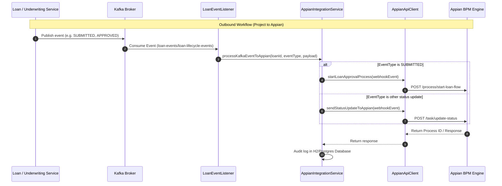
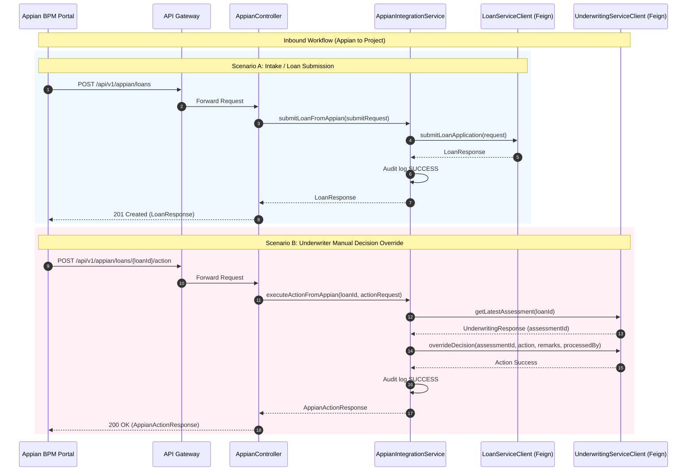

# Appian Workflow Integration Documentation

This document describes how the **Appian BPM (Business Process Management) Platform** integrates with the Freddie Loan Platform.

Integration between the two platforms is split into two primary paths:
1. **Outbound Flow**: From the Freddie Loan Platform services (via Kafka) to Appian, starting process models or notifying active tasks of state changes.
2. **Inbound Flow**: From Appian record views/actions to the Freddie Loan Platform (via REST APIs exposed through the API Gateway), submitting new loans or executing manual underwriting overrides.

---

## Architectural Overview

The integration relies on the [appian-service](file:///c:/ramu/Project_Assignment/RapidX/FreddeMac_Project_RapidX/Freddie_Style_Application/freddie-loan-platform/appian-service) microservice as an integration bridge. 

```
                                  +-----------------------+
                                  |   Appian BPM Portal   |
                                  +-----------+-----------+
                                              ^
                            REST HTTP API     |   REST HTTP Webhook
                         (Inbound to Project) | (Outbound to Appian)
                                              v
+-------------+      +-------------+      +---+-------------------+      +--------------+
|   Clients   |----->| api-gateway |----->|    appian-service     |<-----| Kafka Topics |
+-------------+      +-------------+      +-----------+-----------+      +--------------+
                                                      |
                                        Feign clients | (Internal REST)
                                                      v
                                        +-------------+-------------+
                                        |  loan-origination-service |
                                        |    underwriting-service   |
                                        +---------------------------+
```

---

## 1. Outbound Flow (Project -> Appian)

When a loan's state changes in the platform, an event is sent to Appian to trigger a new workflow or update an existing task.

### Sequence Diagram



### Components Involved:
* **Event Consumer**: [LoanEventListener.java](file:///c:/ramu/Project_Assignment/RapidX/FreddeMac_Project_RapidX/Freddie_Style_Application/freddie-loan-platform/appian-service/src/main/java/com/freddieapp/appian/listener/LoanEventListener.java#L22-L32) subscribes to Kafka topics `loan-events` and `loan-lifecycle-events`.
* **Business Logic**: [AppianIntegrationService.java](file:///c:/ramu/Project_Assignment/RapidX/FreddeMac_Project_RapidX/Freddie_Style_Application/freddie-loan-platform/appian-service/src/main/java/com/freddieapp/appian/service/AppianIntegrationService.java#L36-L80) maps the payload, structures the event metadata, and triggers the Appian API client.
* **Appian HTTP Client**: [AppianApiClient.java](file:///c:/ramu/Project_Assignment/RapidX/FreddeMac_Project_RapidX/Freddie_Style_Application/freddie-loan-platform/appian-service/src/main/java/com/freddieapp/appian/client/AppianApiClient.java) calls the remote Appian endpoint (with basic authentication). 
  > [!NOTE]
  > For non-production development, `simulationMode=true` simulates successful responses and generates mock Process IDs (`SIM-PROC-...`).

---

## 2. Inbound Flow (Appian -> Project)

Appian interacts directly with the Freddie Loan Platform using REST APIs routed through the [api-gateway](file:///c:/ramu/Project_Assignment/RapidX/FreddeMac_Project_RapidX/Freddie_Style_Application/freddie-loan-platform/api-gateway) under the path prefix `/api/v1/appian/**`.

### Sequence Diagram



### Endpoints Exposed in [AppianController.java](file:///c:/ramu/Project_Assignment/RapidX/FreddeMac_Project_RapidX/Freddie_Style_Application/freddie-loan-platform/appian-service/src/main/java/com/freddieapp/appian/controller/AppianController.java):

| HTTP Method | Endpoint Path | Description | Underlying Action |
|---|---|---|---|
| **GET** | `/api/v1/appian/loans` | Retrieve loan applications (paginated) | Fetches from `loan-origination-service` for Appian grid views. |
| **GET** | `/api/v1/appian/loans/{loanId}` | Get detailed loan application details | Fetches detailed loan attributes for Appian record views. |
| **POST** | `/api/v1/appian/loans` | Submit a new loan application | Submits loan application to `loan-origination-service`. |
| **POST** | `/api/v1/appian/loans/{loanId}/action` | Submit manual underwriting action/override | Invokes `underwriting-service` override decision API. |
| **GET** | `/api/v1/appian/integration-logs` | Fetch audit logs of Appian transactions | Returns paginated list of transaction payloads and statuses. |

---

## 3. Auditing and Logging

To ensure traceability, every inbound and outbound message exchanged with Appian is audited in a database:
* The entity [AppianIntegrationLog](file:///c:/ramu/Project_Assignment/RapidX/FreddeMac_Project_RapidX/Freddie_Style_Application/freddie-loan-platform/appian-service/src/main/java/com/freddieapp/appian/entity/AppianIntegrationLog.java) tracks:
  - `integrationType` (e.g. `INBOUND_LOAN_SUBMIT`, `OUTBOUND_START_PROCESS`, `INBOUND_ACTION`)
  - `loanId`
  - `requestPayload` (full JSON)
  - `responsePayload` (full response JSON or exception details)
  - `status` (`SUCCESS` / `FAILED`)
  - `statusCode` (e.g., `200`, `201`, `500`)
  - `timestamp`

These logs are viewable via the `/api/v1/appian/integration-logs` endpoints.

---

## 4. Verification & Testing

You can run the unit and integration tests to verify the integration logic:
* Run the tests in [AppianIntegrationServiceTest.java](file:///c:/ramu/Project_Assignment/RapidX/FreddeMac_Project_RapidX/Freddie_Style_Application/freddie-loan-platform/appian-service/src/test/java/com/freddieapp/appian/AppianIntegrationServiceTest.java) using the following Maven command:
  ```powershell
  mvn clean test -pl appian-service
  ```
