# Freddie Mac-Style Home Loan Application & Customer Management System
## Enterprise Architecture Design Document

**Version:** 1.0 | **Date:** June 2026 | **Author:** Enterprise Architecture Team

---

## 📋 Table of Contents
1. [Executive Summary](#1-executive-summary)
2. [Architecture Overview](#2-architecture-overview)
3. [High-Level Architecture Diagram](#3-high-level-architecture-diagram)
4. [Microservices Design](#4-microservices-design)
5. [Integration Flows](#5-integration-flows)
6. [Data Design (Polyglot Persistence)](#6-data-design-polyglot-persistence)
7. [Security Architecture](#7-security-architecture)
8. [Observability & Monitoring](#8-observability--monitoring)
9. [Deployment Architecture](#9-deployment-architecture)
10. [Failure Handling & Resilience](#10-failure-handling--resilience)
11. [Sample Code Reference](#11-sample-code-reference)

---

## 1. Executive Summary

This document describes the enterprise architecture for a **Freddie Mac-style Home Loan Application and Customer Management Platform**. The system supports end-to-end mortgage lifecycle operations including:

- **Loan Origination** — Customer application intake and initial processing
- **Underwriting** — Risk scoring, credit analysis, and loan decisioning
- **Customer Management** — KYC, profile management, and communication
- **Loan Servicing** — Payment processing, account maintenance, and reporting
- **Legacy System Integration** — Bi-directional integration with existing Java 8 SOAP-based services via Oracle Service Bus (OSB)

### Key Architectural Principles
| Principle | Implementation |
|---|---|
| Domain-Driven Design | Bounded contexts per microservice |
| API-First | OpenAPI/Swagger contracts define all interfaces |
| Event-Driven | Kafka for async loan lifecycle events |
| Database-per-Service | Polyglot persistence (Oracle, PostgreSQL, MongoDB, DB2) |
| Fail-Safe | Circuit breakers, retries, dead-letter queues |
| Zero-Trust Security | OAuth2 + JWT, TLS 1.2+, WS-Security for SOAP |

---

## 2. Architecture Overview

### Architecture Style: Microservices + Event-Driven Hybrid

```
┌─────────────────────────────────────────────────────────────────────┐
│                        PRESENTATION LAYER                           │
│  Angular 21 SPA (Role-Based Dashboards + Lazy Loading + NgRx)       │
└────────────────────────────┬────────────────────────────────────────┘
                             │ HTTPS / REST + OAuth2 Bearer Token
┌────────────────────────────▼────────────────────────────────────────┐
│                     API GATEWAY LAYER                               │
│          Spring Cloud Gateway / Azure API Management                │
│    (Rate Limiting | Auth Filter | SSL Termination | Routing)        │
└────────┬──────────┬──────────┬──────────┬──────────┬───────────────┘
         │          │          │          │          │
    REST/HTTP  REST/HTTP  REST/HTTP  REST/HTTP  REST/HTTP
         │          │          │          │          │
┌────────▼──┐ ┌─────▼───┐ ┌───▼────┐ ┌──▼─────┐ ┌──▼──────────┐
│ Customer  │ │  Loan   │ │Under-  │ │Document│ │Integration  │
│ Service   │ │Origina- │ │writing │ │Service │ │Service      │
│(PostgreSQL│ │tion Svc │ │Service │ │(Mongo  │ │(OSB-bridge) │
│   :8081)  │ │(Oracle  │ │(DB2    │ │  DB    │ │   :8085)    │
│           │ │  :8082) │ │ :8083) │ │  :8084)│ │             │
└────────┬──┘ └─────┬───┘ └───┬────┘ └──┬─────┘ └──────┬──────┘
         │          │          │          │              │
         └──────────┴──────────┴────┬─────┘              │
                                    │                    │
                   ┌────────────────▼──────────────────┐ │
                   │          KAFKA BROKER              │ │
                   │   (loan-events, kyc-events,        │ │
                   │    audit-events, payment-events)   │ │
                   └─────┬──────────────────────────────┘ │
                         │                               │
              ┌──────────▼──────────┐                   │
              │  Notification Svc   │      ┌────────────▼──────────┐
              │  (Kafka Consumer    │      │  ORACLE SERVICE BUS   │
              │   + Email/SMS)      │      │  (OSB Integration Hub)│
              │       :8086         │      │  XML↔JSON Transform   │
              └─────────────────────┘      │  SOAP↔REST Bridging   │
                                           │  Security Policies    │
              ┌──────────────────────────┐ └────────────┬──────────┘
              │   MESSAGING SERVICE      │              │
              │   (ActiveMQ / JMS)       │              │ SOAP/WSDL
              │   Queue-based comm       │  ┌───────────▼──────────┐
              │       :8087              │  │  LEGACY ADAPTER SVC  │
              └──────────────────────────┘  │  (Java 17, JAX-WS)  │
                         │  ActiveMQ        │       :8088          │
                         └──────────────┐  └───────────┬──────────┘
                                        │              │ SOAP
                                        ▼              ▼
                               ┌────────────────────────────────────┐
                               │       ACTIVEMQ BROKER              │
                               │    (Queue: loan.processing.queue)  │
                               └────────────────────────────────────┘

              ┌────────────────────────────────────────────────────┐
              │              LEGACY SYSTEM (Java 8)                │
              │    Apache Tomcat + SOAP/WSDL Services              │
              │    LoanEligibilityService.wsdl                     │
              │    CustomerVerificationService.wsdl                │
              └────────────────────────────────────────────────────┘

              ┌────────────────────────────────────────────────────┐
              │           EXTERNAL SERVICES                        │
              │  ┌─────────────┐  ┌─────────────┐  ┌───────────┐ │
              │  │Credit Bureau│  │Payment GW   │  │ KYC / AML │ │
              │  │REST+OAuth2  │  │REST+OAuth2  │  │REST+OAuth2│ │
              │  └─────────────┘  └─────────────┘  └───────────┘ │
              └────────────────────────────────────────────────────┘
```

---

## 3. High-Level Architecture Diagram

```mermaid
graph TB
    subgraph "Presentation Layer"
        UI["🖥️ Angular 21 SPA\nRole-Based Dashboards\nLazy Loading / NgRx"]
    end

    subgraph "API Gateway Layer"
        GW["🔀 API Gateway\nSpring Cloud Gateway\nRate Limit · Auth · TLS"]
    end

    subgraph "Service Discovery"
        SD["🔍 Eureka Server\nService Registry\n:8761"]
        CFG["⚙️ Config Server\nCentralized Config\n:8888"]
    end

    subgraph "Core Microservices"
        CS["👤 Customer Service\nJava 17 / Spring Boot\nPostgreSQL · :8081"]
        LOS["📋 Loan Origination\nJava 17 / Spring Boot\nOracle DB · :8082"]
        UWS["🔬 Underwriting Service\nJava 17 / Spring Boot\nDB2 · :8083"]
        DS["📁 Document Service\nJava 17 / Spring Boot\nMongoDB · :8084"]
        IS["🔗 Integration Service\nJava 17 / Spring Boot\nOSB-connected · :8085"]
        NS["📨 Notification Service\nJava 17 / Kafka Consumer\n:8086"]
        MS["📬 Messaging Service\nJava 17 / JmsTemplate\nActiveMQ · :8087"]
        LA["🔌 Legacy Adapter\nJava 17 / JAX-WS Client\n:8088"]
    end

    subgraph "Message Infrastructure"
        KAFKA["📡 Apache Kafka\nTopics: loan-events\nkyc-events, audit-events"]
        AMQ["📪 ActiveMQ Broker\nQueue: loan.processing.queue\ndocument.request.queue"]
    end

    subgraph "Integration Layer"
        OSB["🌐 Oracle Service Bus\nRoute · Transform · Bridge\nSOAP↔REST · XML↔JSON"]
    end

    subgraph "Legacy Systems"
        LEGACY["🏛️ Legacy Java 8 App\nApache Tomcat\nSOAP/WSDL Services"]
    end

    subgraph "Databases"
        PG["🐘 PostgreSQL\nCustomer Data"]
        ORA["🔶 Oracle DB\nLoan Processing"]
        DB2["🔷 IBM DB2\nUnderwriting / Risk"]
        MONGO["🍃 MongoDB\nDocuments / Files"]
    end

    subgraph "External Services"
        CB["Credit Bureau API\nEquifax / Experian"]
        PGW["Payment Gateway\nStripe / FIS"]
        KYC["KYC / AML Service\nThird Party"]
    end

    subgraph "Observability"
        ELK["📊 ELK Stack\nElasticsearch · Logstash\nKibana Dashboards"]
        PROM["📈 Prometheus\n+ Grafana Dashboards"]
        ZIPKIN["🔗 Zipkin\nDistributed Tracing"]
    end

    UI -->|HTTPS / JWT| GW
    GW --> CS & LOS & UWS & DS & IS & MS
    GW -.->|Service Discovery| SD
    CS & LOS & UWS & DS & IS & MS & NS & LA -.->|Register| SD
    CS & LOS & UWS & DS & IS & MS & NS & LA -.->|Fetch Config| CFG

    CS --> PG
    LOS --> ORA
    UWS --> DB2
    DS --> MONGO

    LOS -->|Publishes loan-events| KAFKA
    KAFKA -->|Consumes| NS
    LOS -->|Publishes audit-events| KAFKA

    MS -->|JMS Queue| AMQ
    AMQ -->|JMS Queue| DS

    IS --> OSB
    OSB --> LA
    LA -->|SOAP/WSDL| LEGACY

    IS -->|REST + OAuth2| CB & PGW & KYC

    CS & LOS & UWS & IS -.->|Metrics| PROM
    CS & LOS & UWS & IS -.->|Logs| ELK
    CS & LOS & UWS & IS -.->|Traces| ZIPKIN
```



---

## 4. Microservices Design

### 4.1 Customer Service
| Attribute | Details |
|---|---|
| **Port** | `8081` |
| **Java Version** | Java 17 |
| **Database** | PostgreSQL |
| **Communication In** | REST (API Gateway → Customer Service) |
| **Communication Out** | Kafka (publish kyc-events), WebClient (KYC/AML external API) |
| **Package** | `com.freddieapp.customerservice` |

**Responsibilities:**
- Customer profile CRUD (create, read, update, deactivate)
- KYC data collection and status tracking
- AML compliance check via external service (WebClient + OAuth2)
- Customer authentication delegation to Auth Service
- Publishing `CustomerCreatedEvent` and `CustomerUpdatedEvent` to Kafka

**REST API Endpoints:**
```
POST   /api/v1/customers             → Create new customer
GET    /api/v1/customers/{id}        → Get customer details
PUT    /api/v1/customers/{id}        → Update customer profile
DELETE /api/v1/customers/{id}        → Deactivate customer
GET    /api/v1/customers/{id}/kyc    → Get KYC status
POST   /api/v1/customers/{id}/kyc    → Submit KYC documents
GET    /api/v1/customers/search      → Search customers (pagination)
```

---

### 4.2 Loan Origination Service
| Attribute | Details |
|---|---|
| **Port** | `8082` |
| **Java Version** | Java 17 |
| **Database** | Oracle DB |
| **Communication In** | REST (API Gateway → Loan Origination) |
| **Communication Out** | Kafka (publish loan-events), Feign Client (→ Customer Service, → Underwriting Service) |
| **Package** | `com.freddieapp.loanorigination` |

**Responsibilities:**
- Loan application submission and lifecycle management
- Pulling customer profile from Customer Service (Feign)
- Forwarding loan to Underwriting Service for evaluation (Feign)
- Publishing `LoanApplicationCreatedEvent`, `LoanApprovedEvent`, `LoanRejectedEvent` to Kafka
- Storing loan application history and status in Oracle DB

**REST API Endpoints:**
```
POST   /api/v1/loans                     → Submit loan application
GET    /api/v1/loans/{loanId}            → Get loan details
PUT    /api/v1/loans/{loanId}/status     → Update loan status
GET    /api/v1/loans/customer/{custId}   → All loans for customer
GET    /api/v1/loans/{loanId}/eligibility → Check eligibility
POST   /api/v1/loans/{loanId}/submit     → Submit for underwriting
```

**Kafka Events Published:**
```
Topic: loan-lifecycle-events
  → LoanApplicationCreatedEvent { loanId, customerId, amount, type }
  → LoanApprovedEvent { loanId, approvedAmount, interestRate }
  → LoanRejectedEvent { loanId, reason, rejectedDate }
  → LoanDisbursedEvent { loanId, disbursementDate, accountNo }
```

---

### 4.3 Underwriting Service
| Attribute | Details |
|---|---|
| **Port** | `8083` |
| **Java Version** | Java 17 |
| **Database** | IBM DB2 |
| **Communication In** | REST (from Loan Origination via Feign) |
| **Communication Out** | WebClient (Credit Bureau external API), Kafka (publish audit-events) |
| **Package** | `com.freddieapp.underwriting` |

**Responsibilities:**
- Receive loan applications for risk assessment
- Pull credit score from Credit Bureau (WebClient + OAuth2 + Resilience4j)
- Calculate Debt-to-Income (DTI) ratio and Loan-to-Value (LTV) ratio
- Apply underwriting rules engine for loan decisioning (APPROVE / REFER / DECLINE)
- Store underwriting decisions, risk scores in DB2
- Publish audit events to Kafka

**REST API Endpoints:**
```
POST   /api/v1/underwriting/assess       → Submit for underwriting
GET    /api/v1/underwriting/{assessId}   → Get assessment result
GET    /api/v1/underwriting/loan/{loanId} → Get underwriting by loan
```

---

### 4.4 Document Service
| Attribute | Details |
|---|---|
| **Port** | `8084` |
| **Java Version** | Java 17 |
| **Database** | MongoDB |
| **Communication In** | REST (API Gateway → Document Service), ActiveMQ JMS Queue |
| **Communication Out** | ActiveMQ JMS Queue (document.ready.queue) |
| **Package** | `com.freddieapp.documentservice` |

**Responsibilities:**
- Upload, store, and retrieve loan documents (W-2, pay stubs, tax returns, property appraisals)
- Store document metadata and binary content in MongoDB GridFS
- Listen to ActiveMQ queue `document.request.queue` for async document processing requests
- Publish to `document.ready.queue` when document processing is complete
- Generate PDF reports and merge documents

**REST API Endpoints:**
```
POST   /api/v1/documents/upload          → Upload a document
GET    /api/v1/documents/{docId}         → Download a document
GET    /api/v1/documents/loan/{loanId}   → List docs for loan
DELETE /api/v1/documents/{docId}         → Remove document
POST   /api/v1/documents/{docId}/verify  → Mark document as verified
```

---

### 4.5 Notification Service
| Attribute | Details |
|---|---|
| **Port** | `8086` |
| **Java Version** | Java 17 |
| **Database** | PostgreSQL (notification log) |
| **Communication In** | Kafka Consumer (loan-lifecycle-events, kyc-events) |
| **Communication Out** | SMTP Email, SMS Gateway REST |
| **Package** | `com.freddieapp.notificationservice` |

**Responsibilities:**
- Subscribe to Kafka topics for loan and customer events
- Send email notifications for loan status changes, approvals, rejections
- Send SMS alerts for payment reminders and critical milestones
- Maintain notification history and delivery status
- Retry failed notifications (with exponential backoff)

**Kafka Subscriptions:**
```
Topic: loan-lifecycle-events  → LoanApprovedEvent, LoanRejectedEvent
Topic: kyc-events             → KycCompletedEvent, KycFailedEvent
Topic: payment-events         → PaymentReceivedEvent, PaymentOverdueEvent
```

---

### 4.6 Integration Service
| Attribute | Details |
|---|---|
| **Port** | `8085` |
| **Java Version** | Java 17 |
| **Database** | None (stateless routing service) |
| **Communication In** | REST (from other microservices) |
| **Communication Out** | OSB, External REST APIs (Credit Bureau, Payment GW, KYC) |
| **Package** | `com.freddieapp.integrationservice` |

**Responsibilities:**
- Central broker for all external service calls
- Route requests through Oracle Service Bus (OSB) for policy enforcement
- Manage OAuth2 token lifecycle for external API calls (Client Credentials flow)
- Apply circuit breakers (Resilience4j) on all external calls
- Retry logic with exponential backoff

---

### 4.7 Messaging Service
| Attribute | Details |
|---|---|
| **Port** | `8087` |
| **Java Version** | Java 17 |
| **Database** | None |
| **Communication In** | REST (API Gateway), ActiveMQ Queue |
| **Communication Out** | ActiveMQ Queue |
| **Package** | `com.freddieapp.messagingservice` |

**Responsibilities:**
- Provide reliable queue-based messaging between services
- Use `JmsTemplate` to send/receive messages over ActiveMQ
- Route messages to `loan.processing.queue` and `document.request.queue`
- Ensure transactional message delivery with acknowledgment

---

### 4.8 Legacy Adapter Service
| Attribute | Details |
|---|---|
| **Port** | `8088` |
| **Java Version** | Java 17 |
| **Database** | None |
| **Communication In** | REST (from Integration Service via OSB) |
| **Communication Out** | SOAP/WSDL (Legacy Java 8 application) |
| **Package** | `com.freddieapp.legacyadapter` |

**Responsibilities:**
- Act as the modern Java 17 adapter for legacy SOAP-based services
- Use JAX-WS client to call Legacy Java 8 WSDL services:
  - `LoanEligibilityService` — Check if customer qualifies for specific loan products
  - `CustomerVerificationService` — Cross-reference customer data with legacy records
- Transform SOAP responses to modern JSON/REST format
- Apply WS-Security headers to SOAP requests

---

## 5. Integration Flows

### 5.1 REST Synchronous Flow — Loan Application Submission

```
Customer → Angular UI → API Gateway → Loan Origination Service
                                              │
                              Feign Client    │
                    ┌─────────────────────────┤
                    │ GET /customers/{id}      │
                    ▼                          │
            Customer Service                  │
                    │ CustomerDTO              │
                    └─────────────────────────┤
                                              │ Feign Client
                    ┌─────────────────────────┤
                    │ POST /underwriting/assess│
                    ▼                          │
           Underwriting Service               │
                    │ RiskDecision             │
                    └─────────────────────────┘
                                              │
                              Oracle DB SAVE  │
                                              ▼
                         LoanApplicationResponse → API Gateway → Angular UI
```

**Feign Client Configuration:**
```yaml
# application.yml
feign:
  client:
    config:
      customer-service:
        connectTimeout: 5000
        readTimeout: 10000
        loggerLevel: FULL
  circuitbreaker:
    enabled: true
```

---

### 5.2 Kafka Asynchronous Event Flow — Loan Lifecycle Events

```
Loan Origination Service
        │
        │ KafkaTemplate.send("loan-lifecycle-events", LoanApprovedEvent)
        ▼
   Kafka Broker (loan-lifecycle-events topic)
        │
        ├──► Notification Service (@KafkaListener)
        │          → Email: "Your loan #LN-001 has been APPROVED"
        │          → SMS: "Congratulations! Loan approved."
        │
        └──► Audit Service (@KafkaListener)
                   → Store audit record in Audit DB
```

**Kafka Topic Configuration:**
```
Topic: loan-lifecycle-events
  Partitions: 6
  Replication Factor: 3
  Retention: 30 days
  Consumer Groups:
    - notification-consumer-group
    - audit-consumer-group
    - analytics-consumer-group

Topic: kyc-events
  Partitions: 3
  Replication Factor: 3

Topic: payment-events
  Partitions: 6
  Replication Factor: 3
```

---

### 5.3 ActiveMQ JMS Flow — Document Processing

```
Loan Origination Service
        │
        │ JmsTemplate.send("document.request.queue", DocumentRequest)
        ▼
   ActiveMQ Broker
        │
        │ @JmsListener("document.request.queue")
        ▼
   Document Service
        │  Store in MongoDB GridFS
        │  Process document
        │
        │ JmsTemplate.send("document.ready.queue", DocumentReadyEvent)
        ▼
   ActiveMQ Broker
        │
        │ @JmsListener("document.ready.queue")
        ▼
   Messaging Service → Updates Loan Origination Service via REST
```

**JMS Queue Configuration:**
```
Queues:
  - loan.processing.queue       (Loan processing requests)
  - document.request.queue      (Document upload/processing requests)
  - document.ready.queue        (Document processing completion events)
  - notification.email.queue    (Email send requests)
  - dlq.loan.processing         (Dead-letter queue for failed messages)
  - dlq.document.request        (Dead-letter queue for failed documents)

Configuration:
  Max Redeliveries: 3
  Redelivery Delay: 5000ms (exponential backoff)
  DLQ Policy: Per-queue dead-letter destination
```

---

### 5.4 SOAP Legacy Integration via Oracle Service Bus

```
Modern Angular UI / REST Client
        │
        │ POST /api/v1/loans/{id}/eligibility
        ▼
   API Gateway → Integration Service (Java 17, :8085)
        │
        │ REST POST /legacy/loan-eligibility
        ▼
   Oracle Service Bus (OSB)
        │  ┌─────────────────────────────────────────────────────────┐
        │  │ OSB Pipeline:                                           │
        │  │  1. Security Policy: Validate JWT token                 │
        │  │  2. Transform: JSON → XML (XSLT/XQuery mapping)        │
        │  │  3. Protocol Bridge: REST → SOAP                        │
        │  │  4. Route: → Legacy Adapter Service (:8088)            │
        │  │  5. Response Transform: XML → JSON                      │
        │  └─────────────────────────────────────────────────────────┘
        │
        │ SOAP Request (WS-Security headers)
        ▼
   Legacy Adapter Service (Java 17, JAX-WS Client, :8088)
        │
        │ SOAP WSDL Call
        ▼
   Legacy Java 8 App (Apache Tomcat)
        │  LoanEligibilityService.wsdl
        │  CustomerVerificationService.wsdl
        ▼
   SOAP Response
        │
        └── (Reverse flow: XML Response → OSB → JSON → REST Response)
```

**OSB Pipeline Responsibilities:**
| Step | Description |
|---|---|
| **Service Proxy** | Exposes REST endpoint to modern services |
| **JWT Validation** | Validates OAuth2 JWT token via Identity Provider |
| **JSON → XML Transform** | XQuery/XSLT-based payload transformation |
| **WS-Security Header Injection** | Adds `UsernameToken` or X.509 certificate headers |
| **SOAP Routing** | Routes to correct WSDL endpoint |
| **Error Handling** | Standardized fault translation and logging |
| **XML → JSON Transform** | Converts SOAP response back to JSON |
| **SLA Monitoring** | Tracks service response times and SLA compliance |

---

## 6. Data Design (Polyglot Persistence)

### 6.1 Customer Service — PostgreSQL Schema

```sql
-- Schema: freddie_customer

CREATE TABLE customers (
    id              UUID PRIMARY KEY DEFAULT gen_random_uuid(),
    first_name      VARCHAR(100) NOT NULL,
    last_name       VARCHAR(100) NOT NULL,
    email           VARCHAR(255) UNIQUE NOT NULL,
    phone           VARCHAR(20),
    ssn_encrypted   TEXT NOT NULL,              -- AES-256 encrypted
    date_of_birth   DATE NOT NULL,
    nationality     VARCHAR(3),
    address_line1   VARCHAR(255),
    address_line2   VARCHAR(255),
    city            VARCHAR(100),
    state           VARCHAR(50),
    zip_code        VARCHAR(10),
    country         VARCHAR(3) DEFAULT 'USA',
    customer_status VARCHAR(20) DEFAULT 'ACTIVE',
    kyc_status      VARCHAR(20) DEFAULT 'PENDING', -- PENDING, VERIFIED, FAILED
    created_at      TIMESTAMP WITH TIME ZONE DEFAULT NOW(),
    updated_at      TIMESTAMP WITH TIME ZONE DEFAULT NOW(),
    created_by      VARCHAR(100),
    version         BIGINT DEFAULT 0             -- Optimistic locking
);

CREATE TABLE kyc_records (
    id              UUID PRIMARY KEY DEFAULT gen_random_uuid(),
    customer_id     UUID NOT NULL REFERENCES customers(id),
    kyc_provider    VARCHAR(100),
    kyc_reference   VARCHAR(255),
    kyc_status      VARCHAR(20),                -- SUBMITTED, PASSED, FAILED
    risk_level      VARCHAR(20),                -- LOW, MEDIUM, HIGH
    verified_at     TIMESTAMP WITH TIME ZONE,
    expiry_date     DATE,
    remarks         TEXT,
    created_at      TIMESTAMP WITH TIME ZONE DEFAULT NOW()
);

CREATE TABLE customer_contacts (
    id              UUID PRIMARY KEY DEFAULT gen_random_uuid(),
    customer_id     UUID NOT NULL REFERENCES customers(id),
    contact_type    VARCHAR(30),               -- EMAIL, PHONE, MAIL
    contact_value   VARCHAR(255),
    is_primary      BOOLEAN DEFAULT FALSE,
    verified        BOOLEAN DEFAULT FALSE,
    created_at      TIMESTAMP WITH TIME ZONE DEFAULT NOW()
);

-- Indexes
CREATE INDEX idx_customers_email ON customers(email);
CREATE INDEX idx_customers_kyc_status ON customers(kyc_status);
CREATE INDEX idx_kyc_records_customer_id ON kyc_records(customer_id);
```

---

### 6.2 Loan Origination Service — Oracle DB Schema

```sql
-- Schema: FREDDIE_LOANS

CREATE TABLE LOAN_APPLICATIONS (
    LOAN_ID           VARCHAR2(36) PRIMARY KEY,
    CUSTOMER_ID       VARCHAR2(36) NOT NULL,
    LOAN_TYPE         VARCHAR2(50) NOT NULL,    -- PURCHASE, REFINANCE, HELOC
    LOAN_AMOUNT       NUMBER(18, 2) NOT NULL,
    PROPERTY_VALUE    NUMBER(18, 2),
    PROPERTY_ADDRESS  VARCHAR2(500),
    INTEREST_RATE     NUMBER(6, 4),
    LOAN_TERM_MONTHS  NUMBER(4),
    LOAN_STATUS       VARCHAR2(30) DEFAULT 'PENDING',
    APPLICATION_DATE  TIMESTAMP WITH TIME ZONE DEFAULT SYSTIMESTAMP,
    DECISION_DATE     TIMESTAMP WITH TIME ZONE,
    DISBURSEMENT_DATE TIMESTAMP WITH TIME ZONE,
    APPROVED_AMOUNT   NUMBER(18, 2),
    REJECTION_REASON  VARCHAR2(1000),
    CREATED_BY        VARCHAR2(100),
    UPDATED_AT        TIMESTAMP WITH TIME ZONE DEFAULT SYSTIMESTAMP,
    VERSION           NUMBER DEFAULT 0
);

CREATE TABLE LOAN_STATUS_HISTORY (
    HISTORY_ID        VARCHAR2(36) PRIMARY KEY,
    LOAN_ID           VARCHAR2(36) NOT NULL REFERENCES LOAN_APPLICATIONS(LOAN_ID),
    FROM_STATUS       VARCHAR2(30),
    TO_STATUS         VARCHAR2(30) NOT NULL,
    CHANGED_AT        TIMESTAMP WITH TIME ZONE DEFAULT SYSTIMESTAMP,
    CHANGED_BY        VARCHAR2(100),
    NOTES             VARCHAR2(2000)
);

CREATE TABLE LOAN_FEES (
    FEE_ID            VARCHAR2(36) PRIMARY KEY,
    LOAN_ID           VARCHAR2(36) NOT NULL REFERENCES LOAN_APPLICATIONS(LOAN_ID),
    FEE_TYPE          VARCHAR2(100),           -- ORIGINATION, APPRAISAL, TITLE
    FEE_AMOUNT        NUMBER(12, 2),
    FEE_STATUS        VARCHAR2(20),
    COLLECTED_DATE    DATE
);

-- Sequences
CREATE SEQUENCE LOAN_SEQ START WITH 10000 INCREMENT BY 1;
CREATE INDEX IDX_LOAN_CUSTOMER ON LOAN_APPLICATIONS(CUSTOMER_ID);
CREATE INDEX IDX_LOAN_STATUS ON LOAN_APPLICATIONS(LOAN_STATUS);
```

---

### 6.3 Underwriting Service — IBM DB2 Schema

```sql
-- Schema: FREDDIE_UW

CREATE TABLE UNDERWRITING_ASSESSMENTS (
    ASSESSMENT_ID     VARCHAR(36) NOT NULL PRIMARY KEY,
    LOAN_ID           VARCHAR(36) NOT NULL,
    CUSTOMER_ID       VARCHAR(36) NOT NULL,
    CREDIT_SCORE      SMALLINT,               -- e.g., 720
    DTI_RATIO         DECIMAL(5, 2),          -- Debt-to-Income %
    LTV_RATIO         DECIMAL(5, 2),          -- Loan-to-Value %
    ANNUAL_INCOME     DECIMAL(18, 2),
    MONTHLY_DEBT      DECIMAL(12, 2),
    RISK_LEVEL        VARCHAR(20),            -- LOW, MEDIUM, HIGH
    DECISION          VARCHAR(20),            -- APPROVED, REFERRED, DECLINED
    DECISION_REASON   VARCHAR(2000),
    ASSESSED_AT       TIMESTAMP DEFAULT CURRENT_TIMESTAMP,
    ASSESSED_BY       VARCHAR(100),
    BUREAU_REF        VARCHAR(255)            -- Credit bureau reference
);

CREATE TABLE UNDERWRITING_RULES (
    RULE_ID           VARCHAR(36) NOT NULL PRIMARY KEY,
    RULE_NAME         VARCHAR(200) NOT NULL,
    RULE_TYPE         VARCHAR(50),            -- CREDIT_SCORE, DTI, LTV
    MIN_VALUE         DECIMAL(10, 4),
    MAX_VALUE         DECIMAL(10, 4),
    LOAN_TYPE         VARCHAR(50),
    ACTIVE            SMALLINT DEFAULT 1,
    EFFECTIVE_DATE    DATE,
    EXPIRY_DATE       DATE
);

CREATE INDEX IDX_UW_LOAN_ID ON UNDERWRITING_ASSESSMENTS(LOAN_ID);
CREATE INDEX IDX_UW_DECISION ON UNDERWRITING_ASSESSMENTS(DECISION);
```

---

### 6.4 Document Service — MongoDB Collections

```javascript
// Collection: documents
{
    "_id": ObjectId("..."),
    "documentId": "DOC-2026-001234",
    "loanId": "LN-2026-009876",
    "customerId": "CUST-00001",
    "documentType": "W2",               // W2, PAY_STUB, TAX_RETURN, APPRAISAL, ID_PROOF
    "fileName": "john_doe_w2_2025.pdf",
    "mimeType": "application/pdf",
    "sizeBytes": 204800,
    "checksum": "sha256:abc123...",
    "gridFsFileId": ObjectId("..."),    // Reference to GridFS
    "status": "VERIFIED",               // UPLOADED, PROCESSING, VERIFIED, REJECTED
    "verifiedBy": "UNDERWRITER_001",
    "verifiedAt": ISODate("2026-06-29T10:00:00Z"),
    "expiryDate": ISODate("2027-06-29T00:00:00Z"),
    "metadata": {
        "taxYear": 2025,
        "employerName": "ACME Corp",
        "grossIncome": 85000.00
    },
    "uploadedAt": ISODate("2026-06-25T09:30:00Z"),
    "uploadedBy": "user@example.com",
    "tags": ["income-verification", "2025"],
    "version": 1
}

// Collection: document_requests (for JMS queue tracking)
{
    "_id": ObjectId("..."),
    "requestId": "REQ-2026-00123",
    "loanId": "LN-2026-009876",
    "documentTypes": ["W2", "PAY_STUB"],
    "requestStatus": "PENDING",          // PENDING, IN_PROGRESS, COMPLETED
    "requestedAt": ISODate("..."),
    "completedAt": ISODate("..."),
    "jmsCorrelationId": "JMS-CORR-001"
}

// Index definitions
db.documents.createIndex({ "loanId": 1 })
db.documents.createIndex({ "customerId": 1 })
db.documents.createIndex({ "documentType": 1, "status": 1 })
db.documents.createIndex({ "uploadedAt": -1 })
```

---

### Data Ownership Boundaries

```
┌────────────────────────────────────────────────────────────────────┐
│                     DATA OWNERSHIP MAP                             │
├──────────────────────┬─────────────────┬───────────────────────────┤
│ Service              │ Database        │ Owns                       │
├──────────────────────┼─────────────────┼───────────────────────────┤
│ Customer Service     │ PostgreSQL      │ Customers, KYC Records     │
│ Loan Origination     │ Oracle DB       │ Loan Apps, Fees, History   │
│ Underwriting Service │ IBM DB2         │ Risk Assessments, Rules    │
│ Document Service     │ MongoDB         │ Documents, Files (GridFS)  │
│ Notification Service │ PostgreSQL      │ Notification Log           │
├──────────────────────┼─────────────────┼───────────────────────────┤
│ Cross-Service Data   │ Via Kafka Events│ Eventually consistent sync │
│ Sharing              │ (read replicas) │ using event sourcing       │
└──────────────────────┴─────────────────┴───────────────────────────┘

Rule: NO direct cross-database joins between services.
Rule: Services expose data via REST APIs or Kafka events only.
Rule: Read replicas may be used for reporting/analytics separately.
```

---

## 7. Security Architecture

### 7.1 Authentication & Authorization Flow

```
Angular SPA → Azure AD / Keycloak Identity Provider
    │ OAuth2 Authorization Code Flow (PKCE)
    ▼
Access Token (JWT)
    │
Angular SPA → API Gateway
    │ Bearer: <JWT>
    ▼
API Gateway → JWT Validation (public key / JWKS endpoint)
    │ Extract roles: [LOAN_OFFICER, UNDERWRITER, ADMIN]
    ▼
Microservice → @PreAuthorize("hasRole('LOAN_OFFICER')")
```

### 7.2 Security Matrix

| Role | Customer Service | Loan Origination | Underwriting | Documents |
|---|---|---|---|---|
| **CUSTOMER** | R (own profile) | R (own loans) | — | R (own docs) |
| **LOAN_OFFICER** | RW | RW | R | RW |
| **UNDERWRITER** | R | R | RW | RW |
| **ADMIN** | RWDA | RWDA | RWDA | RWDA |

*R=Read, W=Write, D=Delete, A=Admin*

### 7.3 SOAP WS-Security
```xml
<!-- WS-Security Header for Legacy SOAP calls -->
<wsse:Security xmlns:wsse="http://docs.oasis-open.org/wss/2004/01/...">
    <wsse:UsernameToken>
        <wsse:Username>freddie-adapter-svc</wsse:Username>
        <wsse:Password Type="PasswordDigest">...</wsse:Password>
        <wsse:Nonce>...</wsse:Nonce>
        <wsu:Created>2026-06-29T10:00:00Z</wsu:Created>
    </wsse:UsernameToken>
</wsse:Security>
```

---

## 8. Observability & Monitoring

### 8.1 Centralized Logging (ELK Stack)

```
Microservice (SLF4J + Logback)
    │ JSON-structured logs
    ▼
Logstash (collect + parse + enrich)
    │ [traceId, spanId, loanId, customerId]
    ▼
Elasticsearch (store + index)
    ▼
Kibana (Dashboards: Loan Processing Times, Error Rates, SLA Compliance)
```

**Standard Log Format:**
```json
{
    "timestamp": "2026-06-29T10:30:00.000Z",
    "level": "INFO",
    "traceId": "abc123def456",
    "spanId": "789xyz",
    "service": "loan-origination-service",
    "loanId": "LN-2026-009876",
    "customerId": "CUST-00001",
    "message": "Loan application submitted successfully",
    "duration_ms": 245
}
```

### 8.2 Distributed Tracing (OpenTelemetry + Zipkin)

Each service propagates `traceparent` / `X-B3-TraceId` headers through all calls for end-to-end transaction tracing.

### 8.3 Metrics (Prometheus + Grafana)

Key metrics exposed via Spring Actuator `/actuator/prometheus`:
- `loan_applications_total{status="approved|rejected|pending"}`
- `http_request_duration_seconds{service, method, status}`
- `kafka_consumer_lag{topic, consumer_group}`
- `resilience4j_circuit_breaker_state{name}`
- `jvm_memory_used_bytes{area}`
- `db_connection_pool_size{service, db}`

---

## 9. Deployment Architecture

### 9.1 Directory Structure

```
Freddie_Style_Application/
├── architecture_design.md              ← This document
├── code_samples/
│   ├── CustomerController.java
│   ├── KafkaConfig.java
│   ├── LoanLifecycleProducer.java
│   ├── NotificationConsumer.java
│   ├── JmsConfig.java
│   ├── LoanMessagingService.java
│   ├── SoapClientConfig.java
│   └── LegacySoapClient.java
└── deployment/
    ├── docker-compose.yml
    ├── k8s-deployment.yaml
    └── ci-cd-pipeline.yaml

Microservice Structure (per service):
customer-service/
├── pom.xml
├── Dockerfile
├── src/
│   └── main/
│       ├── java/com/freddieapp/customerservice/
│       │   ├── CustomerServiceApplication.java
│       │   ├── config/
│       │   │   ├── SecurityConfig.java
│       │   │   ├── WebClientConfig.java
│       │   │   └── SwaggerConfig.java
│       │   ├── controller/
│       │   │   └── CustomerController.java
│       │   ├── service/
│       │   │   ├── CustomerService.java
│       │   │   └── KycIntegrationService.java
│       │   ├── repository/
│       │   │   └── CustomerRepository.java
│       │   ├── entity/
│       │   │   ├── Customer.java
│       │   │   └── KycRecord.java
│       │   ├── dto/
│       │   │   ├── CustomerRequest.java
│       │   │   ├── CustomerResponse.java
│       │   │   └── KycStatusResponse.java
│       │   ├── event/
│       │   │   └── CustomerCreatedEvent.java
│       │   └── exception/
│       │       ├── GlobalExceptionHandler.java
│       │       └── CustomerNotFoundException.java
│       └── resources/
│           ├── application.yml
│           └── application-docker.yml
```

### 9.2 Dockerfile Pattern

```dockerfile
# Base Dockerfile for all Java 17 microservices
FROM eclipse-temurin:17-jre-alpine AS runtime

LABEL maintainer="freddie-arch-team@example.com"
LABEL service="customer-service"

RUN addgroup -S appgroup && adduser -S appuser -G appgroup
WORKDIR /app

COPY target/*.jar app.jar

RUN chown appuser:appgroup app.jar
USER appuser

EXPOSE 8081

HEALTHCHECK --interval=30s --timeout=10s --start-period=60s --retries=3 \
    CMD wget -q --spider http://localhost:8081/actuator/health || exit 1

ENTRYPOINT ["java", \
    "-Xms256m", "-Xmx512m", \
    "-XX:+UseG1GC", \
    "-Djava.security.egd=file:/dev/./urandom", \
    "-jar", "app.jar"]
```

### 9.3 Kubernetes Architecture

```
Kubernetes Cluster (Azure AKS)
├── Namespace: freddie-infra
│   ├── kafka-cluster (StatefulSet, 3 replicas)
│   ├── activemq-broker (Deployment, 1 replica)
│   ├── eureka-server (Deployment, 2 replicas)
│   └── config-server (Deployment, 2 replicas)
│
├── Namespace: freddie-services
│   ├── customer-service (Deployment, 3 replicas)
│   ├── loan-origination-service (Deployment, 3 replicas)
│   ├── underwriting-service (Deployment, 2 replicas)
│   ├── document-service (Deployment, 2 replicas)
│   ├── notification-service (Deployment, 2 replicas)
│   ├── integration-service (Deployment, 2 replicas)
│   ├── messaging-service (Deployment, 2 replicas)
│   └── legacy-adapter-service (Deployment, 2 replicas)
│
├── Namespace: freddie-gateway
│   └── api-gateway (Deployment, 3 replicas, HPA enabled)
│
├── Namespace: freddie-databases
│   ├── postgresql (StatefulSet, PVC)
│   ├── mongodb (StatefulSet, PVC)
│   └── (Oracle DB2 managed externally / Azure)
│
└── Namespace: freddie-observability
    ├── elasticsearch (StatefulSet)
    ├── logstash (Deployment)
    ├── kibana (Deployment)
    ├── prometheus (Deployment)
    ├── grafana (Deployment)
    └── zipkin (Deployment)
```

---

## 10. Failure Handling & Resilience

### 10.1 Circuit Breaker Configuration (Resilience4j)

```yaml
# For all services calling external APIs
resilience4j:
  circuitbreaker:
    instances:
      credit-bureau-service:
        registerHealthIndicator: true
        slidingWindowSize: 10
        minimumNumberOfCalls: 5
        failureRateThreshold: 50
        waitDurationInOpenState: 30s
        permittedNumberOfCallsInHalfOpenState: 3
        automaticTransitionFromOpenToHalfOpenEnabled: true
      kyc-service:
        slidingWindowSize: 10
        failureRateThreshold: 60
        waitDurationInOpenState: 60s
  retry:
    instances:
      credit-bureau-service:
        maxAttempts: 3
        waitDuration: 2s
        exponentialBackoffMultiplier: 2
  timelimiter:
    instances:
      credit-bureau-service:
        timeoutDuration: 10s
```

### 10.2 Kafka Dead-Letter Queue Strategy

```
Producer publishes to → loan-lifecycle-events
                              │
                  Consumer processing fails (3 retries)
                              │
                              ▼
                    loan-lifecycle-events.DLT
                              │
                    DLQ Monitor (@KafkaListener)
                              │
                   ┌──────────┴─────────┐
                   │  Alert Operations  │
                   │  Store in DB       │
                   │  Manual replay UI  │
                   └────────────────────┘
```

### 10.3 ActiveMQ Dead-Letter Queue Strategy

```
Queue: loan.processing.queue
    │
    │ 3 delivery attempts failed
    ▼
Queue: dlq.loan.processing
    │
    │ @JmsListener("dlq.loan.processing")
    ▼
DLQHandlerService
    → Log failure with JMS message details
    → Alert operations team
    → Store failed payload in audit table
    → Allow manual reprocessing via Admin API
```

### 10.4 Database Resilience

| Pattern | Implementation |
|---|---|
| **Connection Pooling** | HikariCP (max 20 connections per service) |
| **Read Replica** | Oracle Data Guard / PostgreSQL streaming replication |
| **Optimistic Locking** | `@Version` field on all JPA entities |
| **Transaction Management** | `@Transactional` with rollback on checked exceptions |
| **Flyway Migrations** | Database schema versioning per service |

---

## 11. Sample Code Reference

All code samples are located in the `code_samples/` directory:

| File | Description |
|---|---|
| [CustomerController.java](./code_samples/CustomerController.java) | REST Controller with WebClient |
| [KafkaConfig.java](./code_samples/KafkaConfig.java) | Kafka producer/consumer configuration |
| [LoanLifecycleProducer.java](./code_samples/LoanLifecycleProducer.java) | Kafka event producer |
| [NotificationConsumer.java](./code_samples/NotificationConsumer.java) | Kafka event consumer |
| [JmsConfig.java](./code_samples/JmsConfig.java) | ActiveMQ JMS configuration |
| [LoanMessagingService.java](./code_samples/LoanMessagingService.java) | JmsTemplate send/receive |
| [SoapClientConfig.java](./code_samples/SoapClientConfig.java) | SOAP marshaller setup |
| [LegacySoapClient.java](./code_samples/LegacySoapClient.java) | JAX-WS SOAP client |

---

*End of Architecture Design Document*
